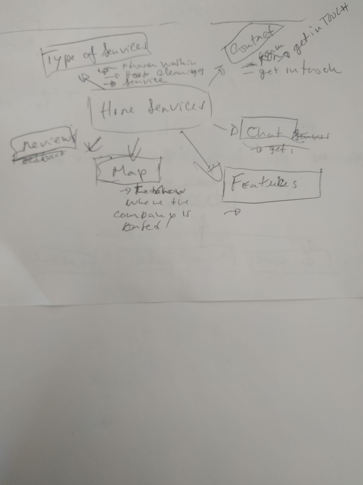
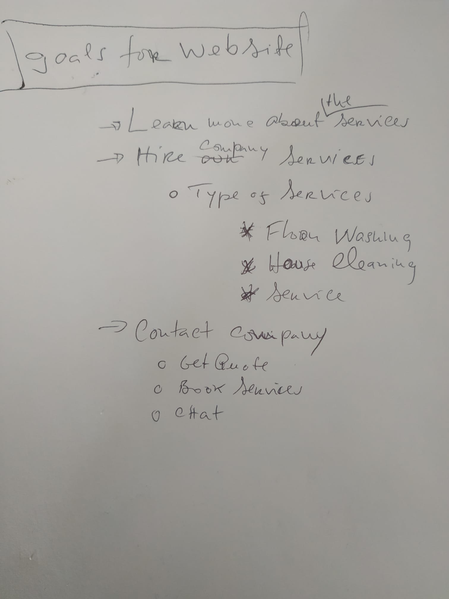
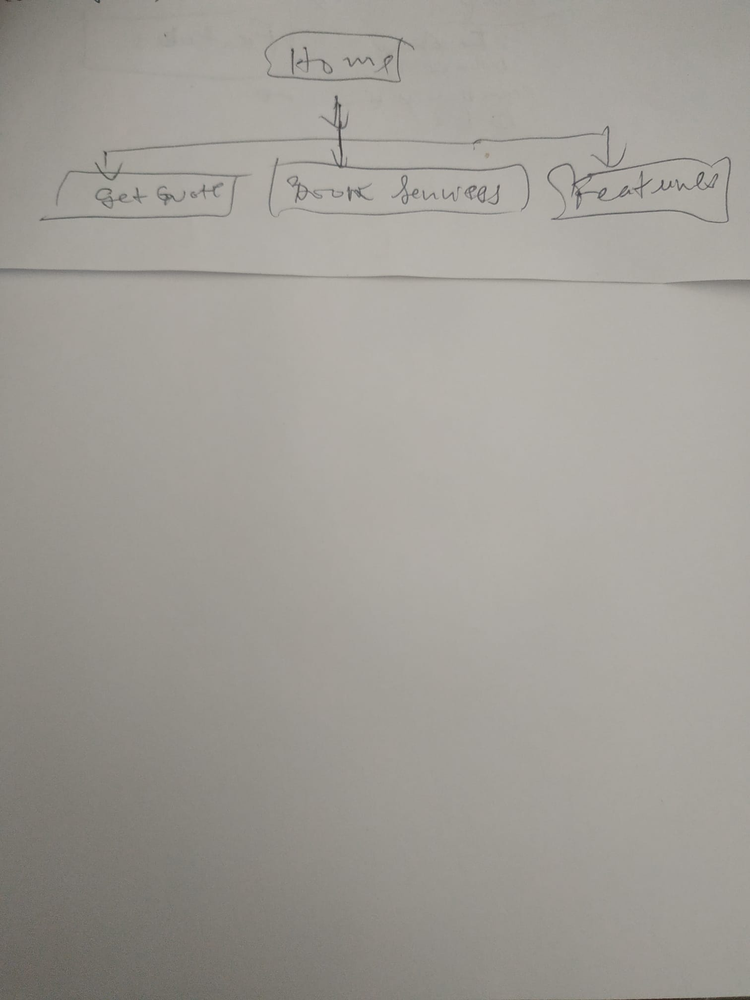
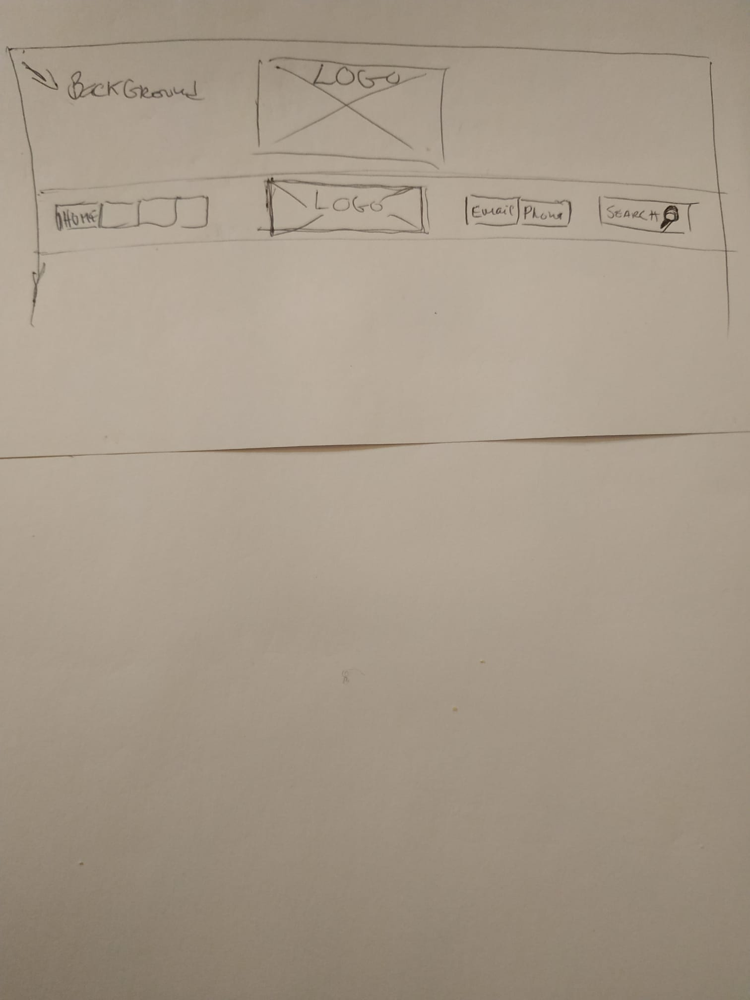
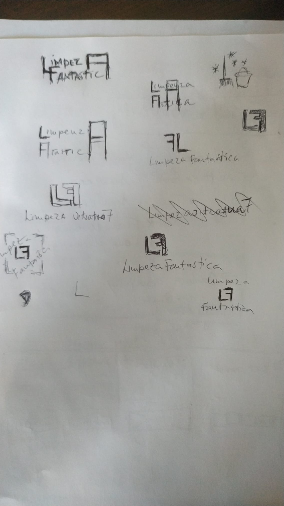
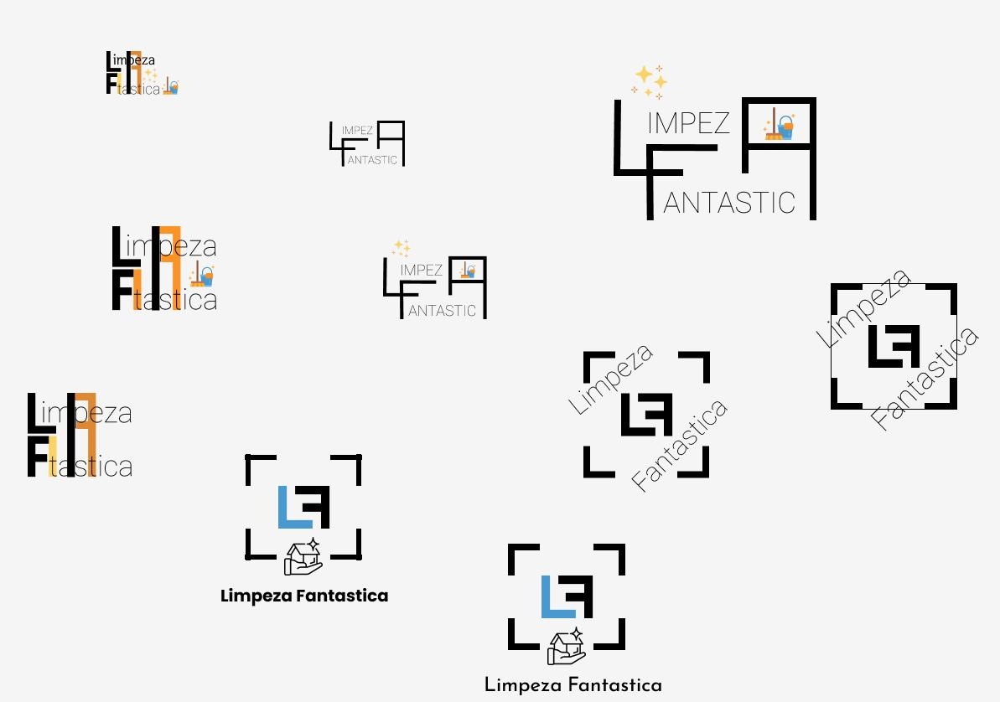

# Cleaning-webapp

It's a personal project that aims building a fictitious cleaning company from start to finish. Hopefully that will allow one to follow my thought process in how I go about building a web app for a company whose goal is getting people to hire their cleaning services. 

## Sitemap planning

The first meeting with the company is to understand what is it that they are trying to achieve. Their gloals. Then I use the sitemap phase to put all the ideas down. **See the screenshots**:

mapping-ideas             |  goals-list                 |   sitemap
:-------------------------:|:-------------------------:|:-----------------------:
  |    |  

## Wireframe

There are many tools used among developers to draw a wireframe, or even the sitemap, but I prefered to adopt to the traditional method `pen and paper`. This stage helps us drawing a draft of what how we want the essential info displayed across the needed pages whithout having to care about styling, positioning, element sizes and so on. **See the screenshots**:

Wireframe for the cleaning web app |
:---------------------------------:

## Logo

From this stage, web design skills are needed to create a website that is both great looking and functional. So, even though I will still get it all done, I won't have any expectations of the end result. 

I drew a few attempts for the company logo based on the its name on pen and paper. And then I used Figma to translate the logos into it and even further developer one or another. **See the screenshots**:

Logos on pen and paper |  Logos on Figma
:----------------------:|:-------------------------:
  |  

